# Ship-hull graphical variants, measured volume, and utility slots

Status: generated asset-measurement report. No gameplay values were changed.

## Result

The installed catalog contains **28 hull templates** and **64 graphical appearances**: 13 human templates with 49 appearances, and 15 alien templates with 15 appearances. Every listed model resource was resolved and rendered.


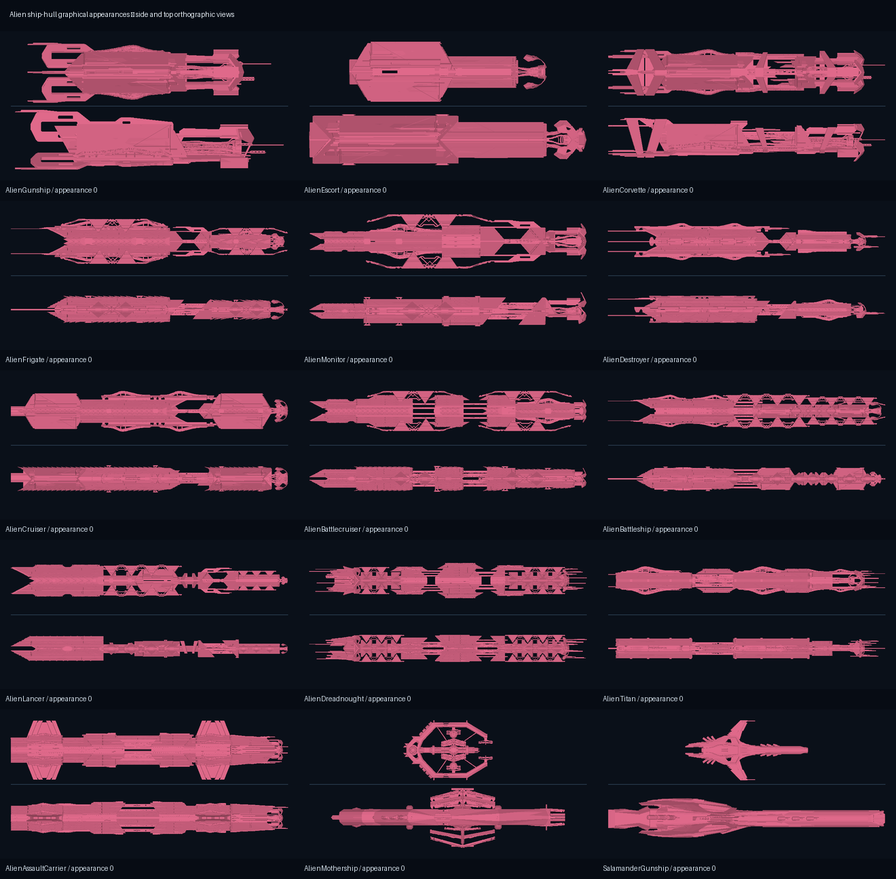

The art-derived values vary much more than the current utility counts. Across all human appearances, the measured main-hull envelope spans **3,452–987,672 m³**; the alien range is **7,358–49,197,069 m³**. These are exterior comparison envelopes, not usable interior volumes.

## What the volume means

For the combined active main-hull mesh bounds `X`, `Y`, and longitudinal length `L`, the report uses:

`Vmain-envelope = pi / 4 * X * Y * L`

The selection starts with the prefab's hull container and excludes the `Drive...` subtree, named radiator/reactor-bay meshes, and leaf meshes named as engines, thrusters, or reactors. The thumbnail is rendered from exactly the same included mesh set. This is the most reproducible volume available from the art without claiming that open or intersecting meshes form a watertight solid or that the exterior envelope is habitable space.

`STOFighter` is the one explicit separation exception: its jet hull is a single mesh with no independent drive or reactor component. Its row is kept for complete catalog coverage and labelled accordingly.

For comparison, `templateStoredVolume_m3` in the evidence is the serialized JSON value, while `runtimeCylinder_m3` applies the compiled-game formula `pi * (width_m / 2)^2 * length_m` after the mod's partial hull overrides. Neither is used to calculate the measured art envelope.

## Slot definition

The table reports nose hardpoints, hull hardpoints, and utility slots separately. `Total` is `nose + hull + utility`. Drive, power-plant, radiator, and armor positions are excluded, matching the established ship-balance analysis.

## Standard human hulls and appearances

| Graphic | Hull | App. | Main hull X × Y × L | Main hull envelope | Nose | Hull | Utility | Total |
|---|---|---:|---:|---:|---:|---:|---:|---:|
| 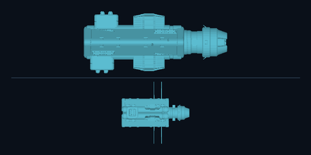 | Gunship | 0 | 14.2 × 30.2 × 32.7 m | 11,020 m³ | 1 | 0 | 2 | 3 |
| 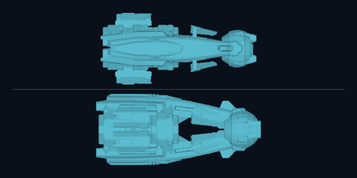 | Gunship | 1 | 15.9 × 15.0 × 34.6 m | 6,474 m³ | 1 | 0 | 2 | 3 |
| 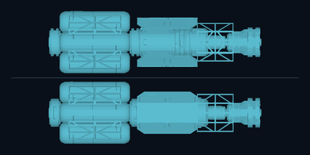 | Gunship | 2 | 10.9 × 10.9 × 37.2 m | 3,452 m³ | 1 | 0 | 2 | 3 |
| 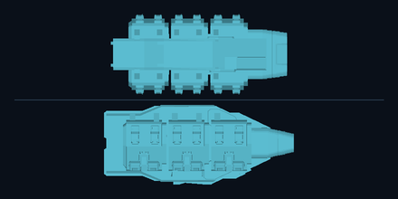 | Gunship | 3 | 13.0 × 12.1 × 28.8 m | 3,575 m³ | 1 | 0 | 2 | 3 |
| 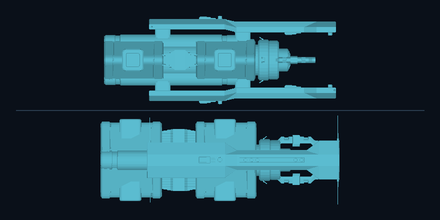 | Escort | 0 | 14.9 × 14.5 × 39.3 m | 6,702 m³ | 0 | 2 | 2 | 4 |
| 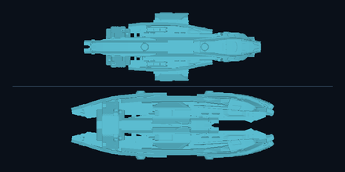 | Escort | 1 | 15.8 × 13.8 × 40.5 m | 6,946 m³ | 0 | 2 | 2 | 4 |
| 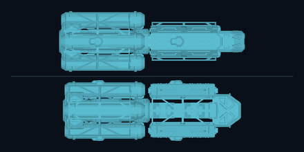 | Escort | 2 | 13.2 × 13.8 × 40.3 m | 5,774 m³ | 0 | 2 | 2 | 4 |
| 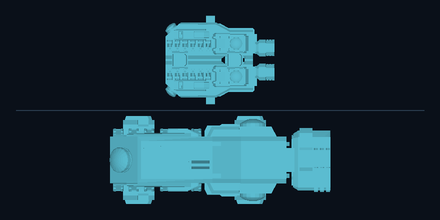 | Escort | 3 | 22.7 × 11.2 × 28.1 m | 5,625 m³ | 0 | 2 | 2 | 4 |
| 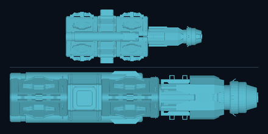 | Corvette | 0 | 16.8 × 9.0 × 42.7 m | 5,071 m³ | 1 | 1 | 3 | 5 |
| 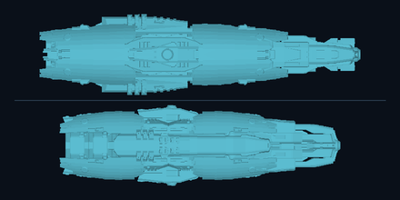 | Corvette | 1 | 14.3 × 16.3 × 57.2 m | 10,446 m³ | 1 | 1 | 3 | 5 |
| 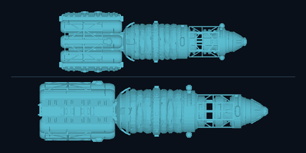 | Corvette | 2 | 19.2 × 15.7 × 58.8 m | 13,890 m³ | 1 | 1 | 3 | 5 |
| 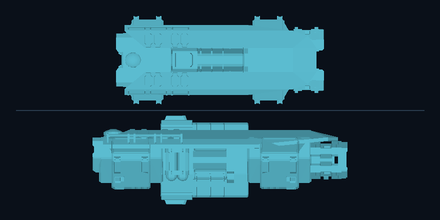 | Corvette | 3 | 19.4 × 15.8 × 45.7 m | 11,004 m³ | 1 | 1 | 3 | 5 |
| 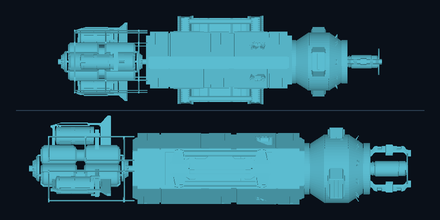 | Frigate | 0 | 17.8 × 15.1 × 65.2 m | 13,692 m³ | 1 | 2 | 5 | 8 |
| 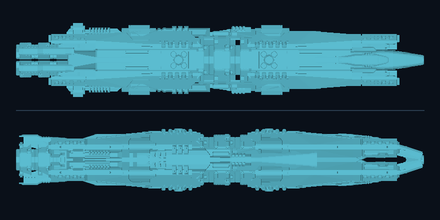 | Frigate | 1 | 15.5 × 13.3 × 86.1 m | 13,924 m³ | 1 | 2 | 5 | 8 |
| 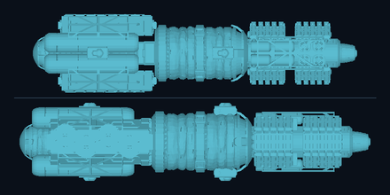 | Frigate | 2 | 18.3 × 16.9 × 76.0 m | 18,459 m³ | 1 | 2 | 5 | 8 |
| 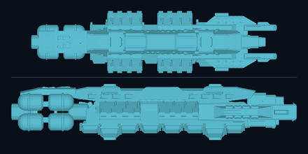 | Frigate | 3 | 21.0 × 16.2 × 83.6 m | 22,333 m³ | 1 | 2 | 5 | 8 |
| 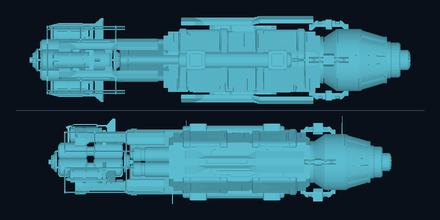 | Monitor | 0 | 16.6 × 18.4 × 71.6 m | 17,160 m³ | 0 | 4 | 3 | 7 |
| 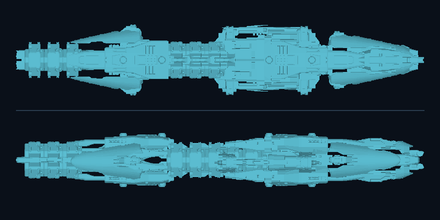 | Monitor | 1 | 20.7 × 15.7 × 119.3 m | 30,395 m³ | 0 | 4 | 3 | 7 |
| 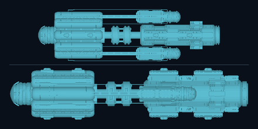 | Monitor | 2 | 27.7 × 21.2 × 97.6 m | 45,073 m³ | 0 | 4 | 3 | 7 |
| 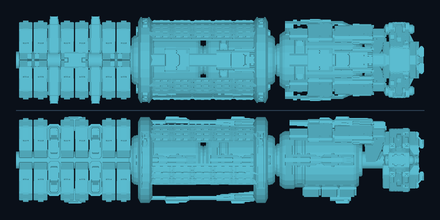 | Monitor | 3 | 23.7 × 23.6 × 111.0 m | 48,695 m³ | 0 | 4 | 3 | 7 |
| 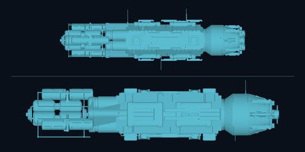 | Destroyer | 0 | 23.3 × 17.0 × 70.7 m | 22,062 m³ | 2 | 2 | 5 | 9 |
| 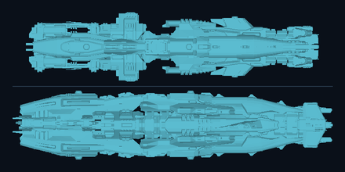 | Destroyer | 1 | 27.9 × 25.5 × 118.5 m | 66,133 m³ | 2 | 2 | 5 | 9 |
| 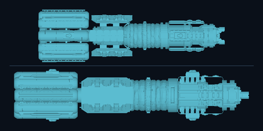 | Destroyer | 2 | 26.9 × 21.3 × 95.2 m | 42,867 m³ | 2 | 2 | 5 | 9 |
| 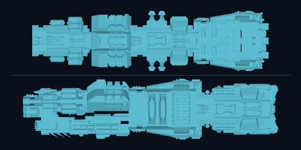 | Destroyer | 3 | 28.0 × 26.0 × 110.1 m | 62,885 m³ | 2 | 2 | 5 | 9 |
| 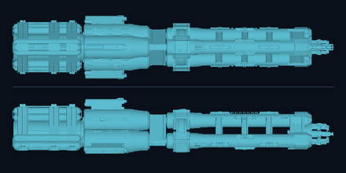 | Cruiser | 0 | 23.6 × 20.7 × 119.6 m | 45,820 m³ | 2 | 3 | 7 | 12 |
| 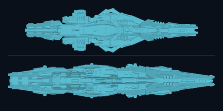 | Cruiser | 1 | 41.4 × 27.4 × 160.6 m | 143,362 m³ | 2 | 3 | 7 | 12 |
| 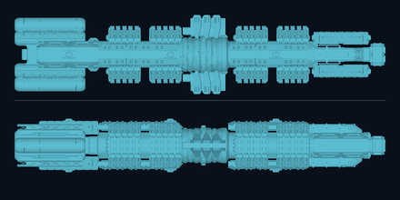 | Cruiser | 2 | 33.7 × 22.9 × 159.6 m | 96,769 m³ | 2 | 3 | 7 | 12 |
| 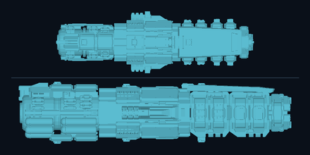 | Cruiser | 3 | 48.1 × 34.9 × 153.2 m | 202,070 m³ | 2 | 3 | 7 | 12 |
| 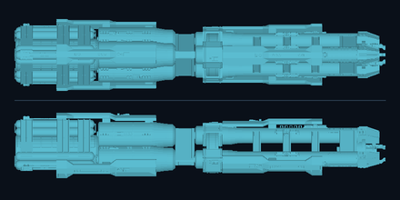 | Battlecruiser | 0 | 22.8 × 20.7 × 117.9 m | 43,684 m³ | 3 | 2 | 5 | 10 |
| 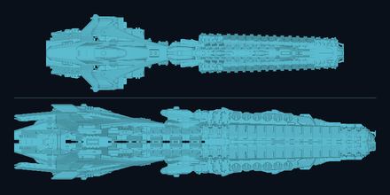 | Battlecruiser | 1 | 40.9 × 32.5 × 155.9 m | 162,618 m³ | 3 | 2 | 5 | 10 |
| 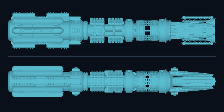 | Battlecruiser | 2 | 27.5 × 23.8 × 157.6 m | 80,741 m³ | 3 | 2 | 5 | 10 |
| 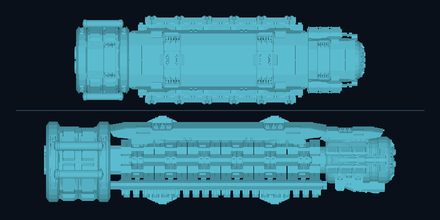 | Battlecruiser | 3 | 45.8 × 37.9 × 151.2 m | 205,739 m³ | 3 | 2 | 5 | 10 |
| 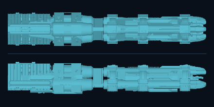 | Battleship | 0 | 28.7 × 27.4 × 170.3 m | 105,143 m³ | 2 | 6 | 6 | 14 |
| 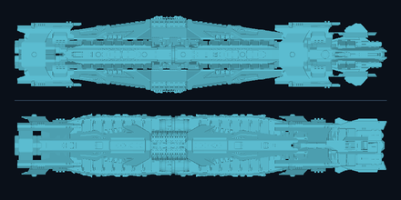 | Battleship | 1 | 37.3 × 31.0 × 180.7 m | 164,048 m³ | 2 | 6 | 6 | 14 |
| 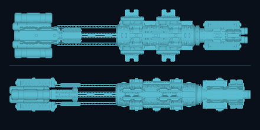 | Battleship | 2 | 39.2 × 24.7 × 176.8 m | 134,464 m³ | 2 | 6 | 6 | 14 |
| 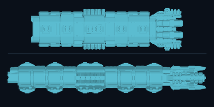 | Battleship | 3 | 47.8 × 26.4 × 169.5 m | 168,181 m³ | 2 | 6 | 6 | 14 |
| 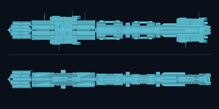 | Lancer | 0 | 43.3 × 20.3 × 220.8 m | 152,598 m³ | 4 | 3 | 7 | 14 |
| 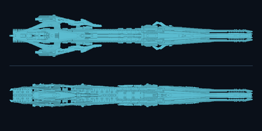 | Lancer | 1 | 43.9 × 24.7 × 252.9 m | 215,349 m³ | 4 | 3 | 7 | 14 |
| 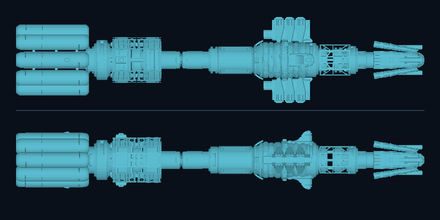 | Lancer | 2 | 46.8 × 31.8 × 222.6 m | 259,685 m³ | 4 | 3 | 7 | 14 |
| 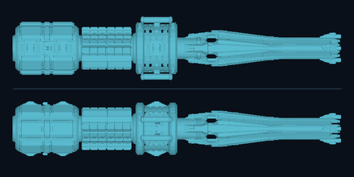 | Lancer | 3 | 42.1 × 35.8 × 217.3 m | 256,682 m³ | 4 | 3 | 7 | 14 |
| 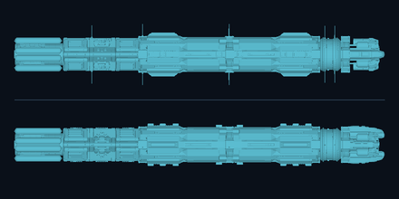 | Dreadnought | 0 | 43.6 × 30.1 × 264.0 m | 272,229 m³ | 3 | 8 | 7 | 18 |
| 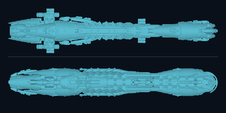 | Dreadnought | 1 | 56.0 × 35.5 × 262.9 m | 410,482 m³ | 3 | 8 | 7 | 18 |
| 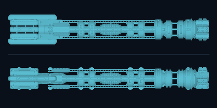 | Dreadnought | 2 | 37.3 × 28.1 × 251.7 m | 207,413 m³ | 3 | 8 | 7 | 18 |
| 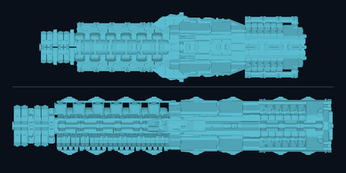 | Dreadnought | 3 | 63.8 × 44.0 × 245.9 m | 542,946 m³ | 3 | 8 | 7 | 18 |
| 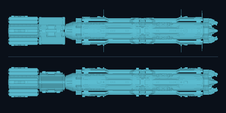 | Titan | 0 | 57.5 × 40.5 × 281.4 m | 514,552 m³ | 4 | 6 | 9 | 19 |
| 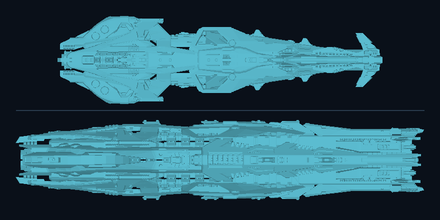 | Titan | 1 | 74.7 × 53.5 × 275.7 m | 865,495 m³ | 4 | 6 | 9 | 19 |
| 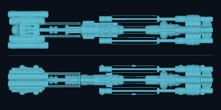 | Titan | 2 | 49.0 × 39.9 × 265.0 m | 407,509 m³ | 4 | 6 | 9 | 19 |
| 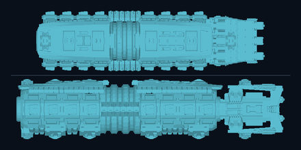 | Titan | 3 | 73.0 × 62.2 × 276.7 m | 987,672 m³ | 4 | 6 | 9 | 19 |

## Special human hull

| Graphic | Hull | App. | Main hull X × Y × L | Main hull envelope | Nose | Hull | Utility | Total |
|---|---|---:|---:|---:|---:|---:|---:|---:|
| 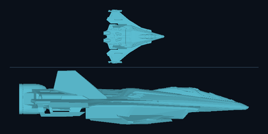 | STOFighter | 0 | 25.8 × 6.9 × 29.3 m | 4,082 m³ | 1 | 1 | 1 | 3 |

## Alien hulls

| Graphic | Hull | App. | Main hull X × Y × L | Main hull envelope | Nose | Hull | Utility | Total |
|---|---|---:|---:|---:|---:|---:|---:|---:|
|  | AlienGunship | 0 | 15.6 × 14.1 × 63.3 m | 10,892 m³ | 1 | 0 | 3 | 4 |
|  | AlienEscort | 0 | 16.8 × 10.1 × 55.3 m | 7,358 m³ | 0 | 2 | 4 | 6 |
|  | AlienCorvette | 0 | 14.4 × 13.4 × 86.5 m | 13,174 m³ | 1 | 1 | 4 | 6 |
|  | AlienFrigate | 0 | 22.0 × 13.1 × 135.7 m | 30,660 m³ | 1 | 3 | 5 | 9 |
|  | AlienMonitor | 0 | 31.2 × 19.3 × 159.8 m | 75,476 m³ | 1 | 4 | 5 | 10 |
|  | AlienDestroyer | 0 | 22.3 × 16.1 × 167.6 m | 47,314 m³ | 2 | 2 | 5 | 9 |
|  | AlienCruiser | 0 | 25.4 × 16.7 × 174.0 m | 57,948 m³ | 2 | 4 | 7 | 13 |
|  | AlienBattlecruiser | 0 | 36.9 × 23.3 × 255.7 m | 172,808 m³ | 3 | 3 | 6 | 12 |
|  | AlienBattleship | 0 | 35.4 × 25.1 × 288.2 m | 201,325 m³ | 2 | 6 | 7 | 15 |
|  | AlienLancer | 0 | 31.6 × 24.5 × 274.7 m | 166,672 m³ | 6 | 4 | 7 | 17 |
|  | AlienDreadnought | 0 | 39.8 × 30.7 × 315.6 m | 302,990 m³ | 4 | 8 | 9 | 21 |
|  | AlienTitan | 0 | 39.5 × 28.8 × 391.2 m | 349,989 m³ | 6 | 8 | 7 | 21 |
|  | AlienAssaultCarrier | 0 | 58.6 × 33.0 × 275.8 m | 419,182 m³ | 0 | 6 | 6 | 12 |
|  | AlienMothership | 0 | 478.3 × 182.8 × 716.2 m | 49,197,069 m³ | 4 | 16 | 7 | 27 |
|  | SalamanderGunship | 0 | 31.6 × 9.1 × 64.7 m | 14,539 m³ | 1 | 1 | 1 | 3 |

## Hull-level utility-slot planning view

Graphical appearances share template slot counts but can have different art envelopes. The range below prevents one appearance from being mistaken for the whole hull class.

| Hull | Utility | Weapon + utility | Appearance count | Main-hull envelope range | Envelope per utility slot |
|---|---:|---:|---:|---:|---:|
| Gunship | 2 | 3 | 4 | 3,452–11,020 m³ | 1,726–5,510 m³ |
| Escort | 2 | 4 | 4 | 5,625–6,946 m³ | 2,813–3,473 m³ |
| Corvette | 3 | 5 | 4 | 5,071–13,890 m³ | 1,690–4,630 m³ |
| Frigate | 5 | 8 | 4 | 13,692–22,333 m³ | 2,738–4,467 m³ |
| Monitor | 3 | 7 | 4 | 17,160–48,695 m³ | 5,720–16,232 m³ |
| Destroyer | 5 | 9 | 4 | 22,062–66,133 m³ | 4,412–13,227 m³ |
| Cruiser | 7 | 12 | 4 | 45,820–202,070 m³ | 6,546–28,867 m³ |
| Battlecruiser | 5 | 10 | 4 | 43,684–205,739 m³ | 8,737–41,148 m³ |
| Battleship | 6 | 14 | 4 | 105,143–168,181 m³ | 17,524–28,030 m³ |
| Lancer | 7 | 14 | 4 | 152,598–259,685 m³ | 21,800–37,098 m³ |
| Dreadnought | 7 | 18 | 4 | 207,413–542,946 m³ | 29,630–77,564 m³ |
| Titan | 9 | 19 | 4 | 407,509–987,672 m³ | 45,279–109,741 m³ |
| STOFighter | 1 | 3 | 1 | 4,082–4,082 m³ | 4,082–4,082 m³ |
| AlienGunship | 3 | 4 | 1 | 10,892–10,892 m³ | 3,631–3,631 m³ |
| AlienEscort | 4 | 6 | 1 | 7,358–7,358 m³ | 1,840–1,840 m³ |
| AlienCorvette | 4 | 6 | 1 | 13,174–13,174 m³ | 3,294–3,294 m³ |
| AlienFrigate | 5 | 9 | 1 | 30,660–30,660 m³ | 6,132–6,132 m³ |
| AlienMonitor | 5 | 10 | 1 | 75,476–75,476 m³ | 15,095–15,095 m³ |
| AlienDestroyer | 5 | 9 | 1 | 47,314–47,314 m³ | 9,463–9,463 m³ |
| AlienCruiser | 7 | 13 | 1 | 57,948–57,948 m³ | 8,278–8,278 m³ |
| AlienBattlecruiser | 6 | 12 | 1 | 172,808–172,808 m³ | 28,801–28,801 m³ |
| AlienBattleship | 7 | 15 | 1 | 201,325–201,325 m³ | 28,761–28,761 m³ |
| AlienLancer | 7 | 17 | 1 | 166,672–166,672 m³ | 23,810–23,810 m³ |
| AlienDreadnought | 9 | 21 | 1 | 302,990–302,990 m³ | 33,666–33,666 m³ |
| AlienTitan | 7 | 21 | 1 | 349,989–349,989 m³ | 49,998–49,998 m³ |
| AlienAssaultCarrier | 6 | 12 | 1 | 419,182–419,182 m³ | 69,864–69,864 m³ |
| AlienMothership | 7 | 27 | 1 | 49,197,069–49,197,069 m³ | 7,028,153–7,028,153 m³ |
| SalamanderGunship | 1 | 3 | 1 | 14,539–14,539 m³ | 14,539–14,539 m³ |

## Interpretation for adding utility slots

The measurements support using hull volume as a constraint or audit signal, but not a direct one-slot-equals-N-cubic-metres rule. Current utility slots are categorical permissions; larger hulls also devote more art volume to structure, weapons, tanks, armor clearance, damage tolerance, and heat-management machinery. Appearance spreads further show that a hull template can retain one slot layout while its art envelope changes materially.

A later utility-slot change should therefore choose hull-level counts first, then use the smallest measured appearance envelope as the conservative art check. The present report supplies that evidence but does not recommend or implement new counts yet.

## Reproducibility

- Installed hull template SHA-256: `36952BDDFFCBEBE1C3AB2C2141B7D7DF53F985C0EED326C5A43A9B52BD86826B`
- Base `ships` bundle SHA-256: `F1804254B5C6F2C2FFBF78C333738F462BAA18023AC5AACF9A8EACAA4D9F09A4`
- Dark Skies `ships_prm` bundle SHA-256: `9035AD167BC1371462D0FAFC709764B446BA21D4B5C7F41917465483706A31BC`
- Mod hull override SHA-256: `589F168B1819CAA2351612A4416DE31D8D7B7BE7F2AFB512D5D9338D0C3095E4`
- Generator: [`generate_hull_variant_report.py`](../../scripts/ship-balance/generate_hull_variant_report.py)
- Shared prefab traversal: [`measure_ship_prefabs.py`](../../scripts/ship-balance/measure_ship_prefabs.py)
- Machine-readable rows: [`hull-variant-volume-and-slots.csv`](tables/hull-variant-volume-and-slots.csv)
- Full mesh-path evidence: [`hull-variant-volume-and-slots.json`](tables/hull-variant-volume-and-slots.json)

Run from the repository root with Python 3.12, NumPy, Pillow, UnityPy, and a local Terra Invicta installation:

```powershell
python scripts/ship-balance/generate_hull_variant_report.py `
  --game-install-dir 'D:\Games\SteamLibrary\steamapps\common\Terra Invicta'
```

The generator omits timestamps, sorts machine-readable keys, and uses fixed rendering settings so identical inputs produce identical files.
